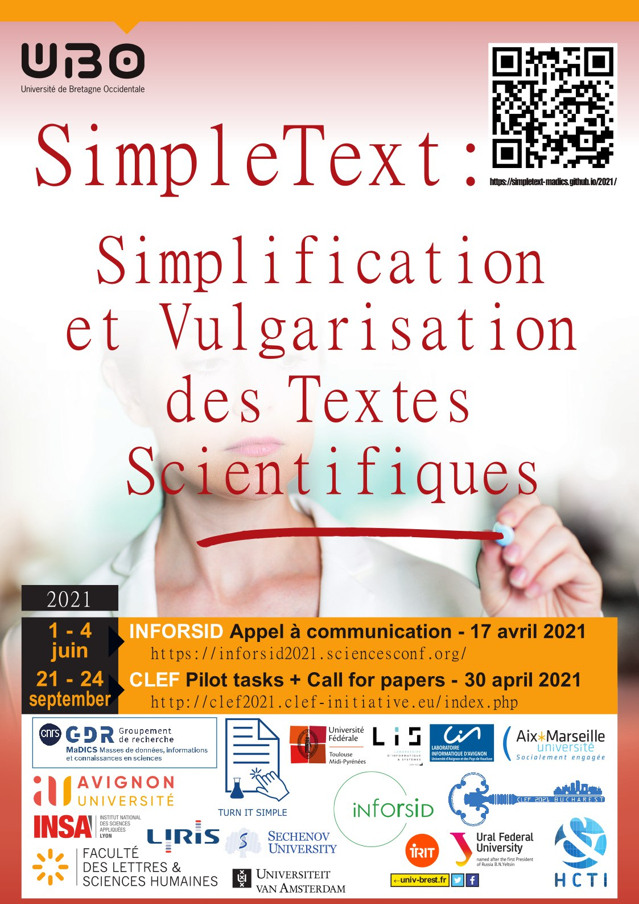

# SimpleText@INFORSID Accueil

[Accueil](./) | [Appel à communication](./CFP) | [Programme](./program)  | [Comité de programme](./comite) | [Contacts](./contacts) | 

---

---

### Contexte : 
Les systèmes modernes d'accès à l'information promettent de donner aux citoyens un accès direct à des informations clés provenant de sources primaires faisant autorité. La littérature scientifique est concernée mais est en réalité difficilement accessible aux non-experts en raison de la complexité langagière, la structure, longueur, etc des documents scientifiques et du manque d’acculturation scientifique. La teneur du débat scientifique qui procède par confrontation d’une multiplicité d’études avant de parvenir à un consensus est aussi source de complexité.  Les décisions individuelles ou politiques sont potentiellement impactées par une méconnaissance  de l'ensemble des travaux et débats  scientifiques.

Cette difficulté de lecture  existe également lorsque les scientifiques s’intéressent aux documents scientifiques de disciplines pour lesquelles  ils ne sont pas experts. Les résultats contradictoires à l’intérieur même d’une discipline sont difficilement appréhendables par des non-spécialistes. Quid alors des résultats contradictoires entre disciplines?  

La simplification de textes se donne pour objectif  de réduire ces obstacles. 

L'atelier SimpleText abordera les opportunités et les défis des approches de simplification de textes scientifiques pour améliorer l'accès à l'information scientifique et l’acculturation scientifique. 

L'atelier SimpleText s’appuiera sur une communauté interdisciplinaire de chercheurs en traitement automatique de la langue, recherche d’information, linguistique, sociologie,  journalisme scientifique et vulgarisation scientifique travaillant ensemble pour tenter de résoudre l'un des plus grands défis d'aujourd'hui.
L'atelier SimpleText s’inscrit dans le cadre du Groupement de Recherche MaDICS ([Masses de Données, Informations et Connaissances en Sciences](https://www.madics.fr/ateliers/simpletext/)).

### Mots clés: 
* Simplification et vulgarisation scientifique
* Résumé multidocuments
* Contextualisation
* Traitement automatique de la langue naturelle
* Recherche d’information
